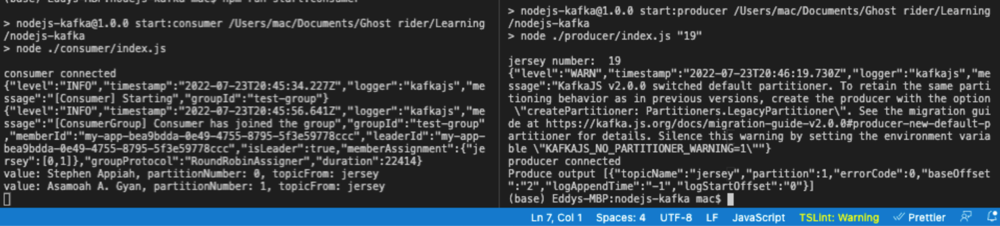

## Installation guide
1.  Change directory into repo directory eg: `cd nodejs-kafka `
2.  Run `npm install` to install necessaty libraries and dependencies
3.  I'm using node version v14.20.0 

## This is the fun bit
1.  Run `make up` to get zookeeper and kafka services running. (You should already have docker installed and running)
2.  Next, we create a topic and partition to work with. We do this by running command `make create-partition-topic`
You should see  a console message of this nature "2 partitions created of topic jersey".
Partition size and topic can be modified in the kafka.config.js file.
3.  Run `node run start:producer 7`. Number  could be any number but for this demo choices are limited to 7, 10, 1, 45 and    19    
4. Run `node run start:consumer` to see the messages in real-time.
5. AWESOME right.

## Tear-down
1.  Run `make down` to destroy zookeeper and kafka services

# Screenshots

